<h3>Building practical AI systems from data → models → applications → deployment</h3>

  
  

---

## 👨‍💻 About Me

I'm **Vedant Shinde**, an AI/ML-focused developer interested in building useful, measurable, and deployable intelligent applications.

- 🤖 Machine Learning, Deep Learning & Computer Vision
- 🧠 Transfer Learning, Model Training & Evaluation
- 📊 Data Analysis and practical problem solving
- 🚀 Streamlit, Supabase and AI application deployment
- 💻 Python, SQL and Java
- 🎯 Currently improving my skills in **AI Engineering and Generative AI**

> **Build → Evaluate → Improve → Deploy**

---

## 🛠️ Tech Stack

  

---

## ⭐ Featured Projects

<table>
<tr>
<td width="50%" valign="top">

### 🦴 Fracture Detection AI

**MobileNetV2 · TensorFlow · Streamlit · Supabase**

AI-assisted bone X-ray classification system using transfer learning and fine-tuning, with authentication and deployment.

**73.50% Test Accuracy**  
**78.06% Fracture Recall**  
**600 Held-out Test Images**

<a href="https://github.com/vedant-4009/fracture-detection-cnn">View Repository →</a>

</td>
<td width="50%" valign="top">

### 🏥 MediScan AI

**AI · Machine Learning · JavaScript**

Medical X-ray focused intelligent application exploring practical AI workflows and user-facing development.

<a href="https://github.com/vedant-4009/mediscan-ai">View Repository →</a>

</td>
</tr>
<tr>
<td width="50%" valign="top">

### 🎨 Image Colorization

**Deep Learning · Computer Vision**

Project focused on converting grayscale images into colorized outputs using deep learning techniques.

<a href="https://github.com/vedant-4009/Image-colorization-project">View Repository →</a>

</td>
<td width="50%" valign="top">

### 📊 Customer Shopping Analysis

**Python · Data Analysis · Visualization**

Analysis of customer shopping behavior to discover patterns and useful business insights.

<a href="https://github.com/vedant-4009/Customer-Shopping-Analysis">View Repository →</a>

</td>
</tr>
</table>

---

## 📊 GitHub Analytics

  
  

  

> **Reliable stats:** these cards are generated inside this repository by GitHub Actions and refreshed automatically every day.

---

## 📈 Contribution Activity

  

  <i>Contribution activity • regenerated automatically every 12 hours</i>

---

## 🐍 Contribution Snake

  <picture>
    <source media="(prefers-color-scheme: dark)" srcset="https://raw.githubusercontent.com/vedant-4009/vedant-4009/output/github-contribution-grid-snake-dark.svg" />
    <source media="(prefers-color-scheme: light)" srcset="https://raw.githubusercontent.com/vedant-4009/vedant-4009/output/github-contribution-grid-snake-light.svg" />
    
  </picture>

  <i>🐍 Animated from my GitHub contribution graph • updated automatically every day</i>

---

## 💡 What I Build

| Area | What I work on |
|---|---|
| 🤖 AI / ML | Classification, prediction, model evaluation |
| 🧠 Deep Learning | CNNs, transfer learning & fine-tuning |
| 👁️ Computer Vision | X-ray analysis, image processing & colorization |
| 📊 Data Science | EDA, visualization & business insights |
| ✨ Generative AI | Practical AI application patterns |
| 🚀 Deployment | Turning models into usable applications |

---

## 🎯 Current Focus

- Building stronger **end-to-end AI projects**
- Improving **model evaluation and deployment** skills
- Learning more about **Generative AI and AI Engineering**
- Writing cleaner, documented, recruiter-friendly projects

---

## 📫 Connect With Me

  
  

**Build • Evaluate • Improve • Deploy**

